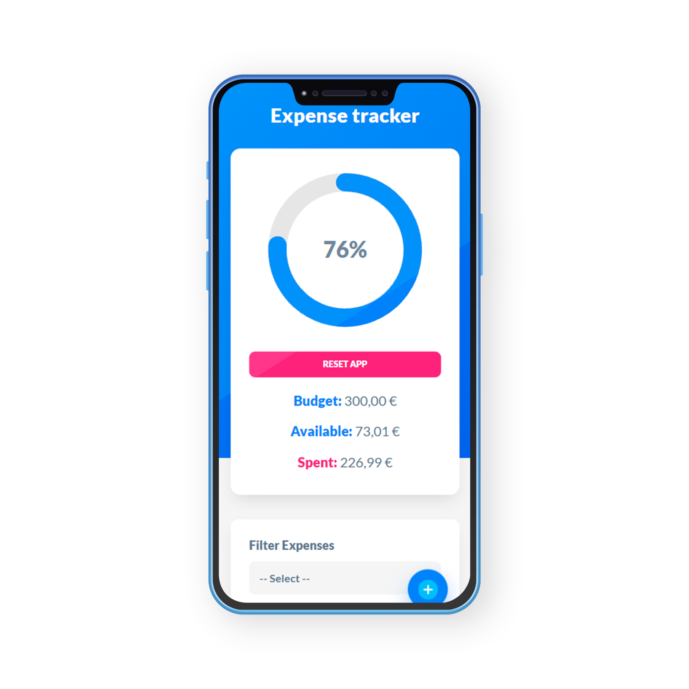

# Expense Tracker

A simple and clean expense tracking application built with **Vue 3** and **Vite**, designed to help users manage their personal budget and track daily expenses.

This project was created as a learning exercise to practice Vue's **Composition API**, state management, and component-based architecture.

---


## Screenshots


<p align="center">
  
  
</p>
---

## Features

- Set an initial budget
- Add, edit and delete expenses
- Categorize expenses
- Real-time budget calculation
- Visual progress indicator
- Modal-based expense form
- Responsive and minimal UI
- Frontend-only (no backend)

---

## Stack

- **Vue 3**
- **Vite**
- **JavaScript**
- **CSS**

---

## What I learned

- Vue 3 Composition API (`ref`, `reactive`, `computed`, `watch`)
- Component communication using props and emits
- Reactive state management
- Modal handling and UI state
- Data formatting and helpers
- Clean project structure

---

## Getting Started

### 1. Clone the repository
```
git clone https://github.com/LuisoJSM/vue-expense-tracker.git
```
### 2. Install dependencies
```
npm install
```
### 3. Run the development server
```
npm run dev
```
